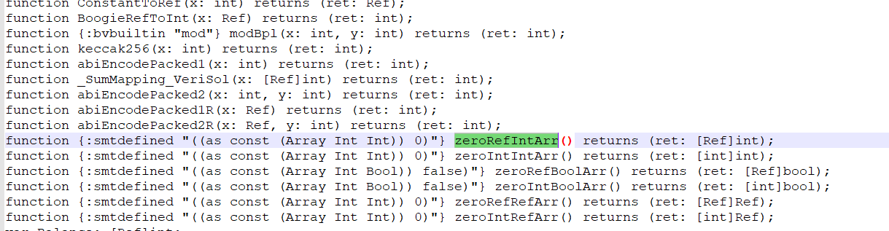
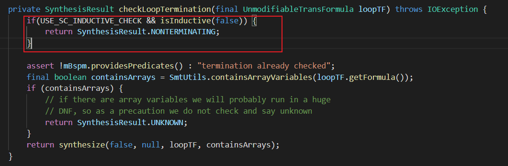
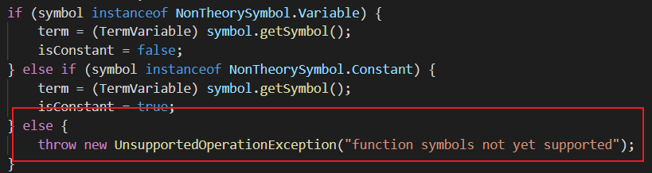
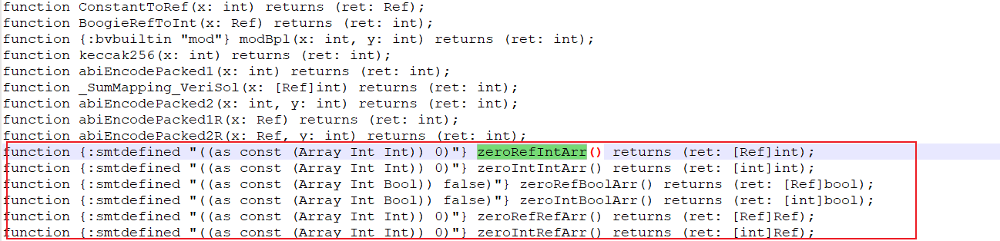
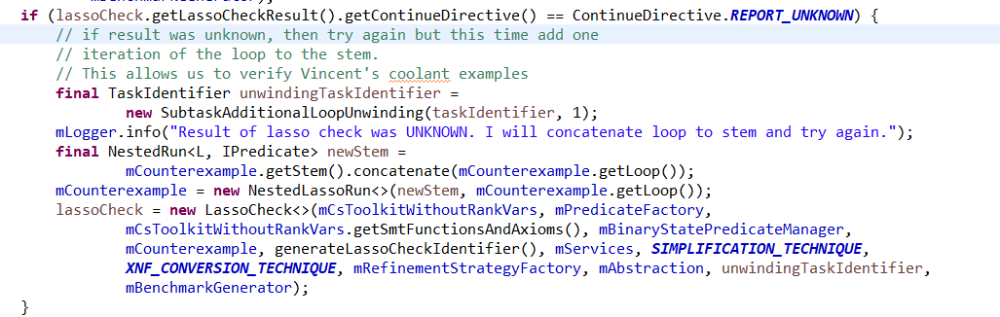

---

typora-copy-images-to: ..\images
---

- “z3插值模式”的preference应该是设置不了了，因为4.7.1后的版本都删除了对于插值模式的支持，然而尝试了4.7.1的z3也不能够运行，推测可能是现在的UA使用了新Z3的一些特性

- 可以考虑将boogieprinter仅调用boogie相关的验证（`BoogieLTL.xml`）来check插桩的正确性，避免插桩可能的bug导致复杂化

  - `p4example_text.bpl`

  - 测试：`#LTLProperty: [](AP(isValid[hdr.ipv4] == true))`，使用`BoogieLTL.xml`验证报错：`Arrays with Bool as argument are not supported`

    - 考虑使用普通变量代替，但是不看好，因为P4LTL也是这样做的

      - 仍然失败，报同样的错

    - 将`isValid`替换为`[Ref]int`，赋值与否使用01代替

      - 还是失败，报同样的错，是否是因为文件中还存在`emit [Ref]bool`的缘故？

      - 尝试修改`emit`为`[Ref] int`

        - 不报`Arrays with Bool as argument are not supported`这个错了，**看来boogie文件不能够出现`[Ref] bool`类型**

        - 但是报了新错误：`function symbols not yet supported`

          - 修改代码，尝试打印具体到底是什么symbol：`function symbols not yet supported: (add.bv8 (_ BitVec 8) (_ BitVec 8) (_ BitVec 8))`

            - 好消息是前缀应该是支持function symbol的，坏消息是这部分不支持的应该是秩函数综合的部分（从trace back中推测——`checkLassoTermination`这个函数需要在check stem和loop的feasiblity之后才调用，并且就是最后调用的了——前面所有的前缀check的部分都支持function symbol）：

            ```
            	at de.uni_freiburg.informatik.ultimate.lassoranker.variables.LassoPartitioneer.addInOuAuxVar(LassoPartitioneer.java:238)
            	at de.uni_freiburg.informatik.ultimate.lassoranker.variables.LassoPartitioneer.constructTransFormulaLR(LassoPartitioneer.java:210)
            	at de.uni_freiburg.informatik.ultimate.lassoranker.variables.LassoPartitioneer.doPartition(LassoPartitioneer.java:166)
            	at de.uni_freiburg.informatik.ultimate.lassoranker.variables.LassoPartitioneer.<init>(LassoPartitioneer.java:95)
            	at de.uni_freiburg.informatik.ultimate.lassoranker.preprocessors.LassoPartitioneerPreprocessor.process(LassoPartitioneerPreprocessor.java:65)
            	at de.uni_freiburg.informatik.ultimate.lassoranker.variables.LassoBuilder.applyPreprocessor(LassoBuilder.java:154)
            	at de.uni_freiburg.informatik.ultimate.lassoranker.variables.LassoBuilder.preprocess(LassoBuilder.java:262)
            	at de.uni_freiburg.informatik.ultimate.lassoranker.LassoAnalysis.preprocess(LassoAnalysis.java:280)
            	at de.uni_freiburg.informatik.ultimate.lassoranker.LassoAnalysis.<init>(LassoAnalysis.java:229)
            	at de.uni_freiburg.informatik.ultimate.plugins.generator.buchiautomizer.LassoCheck.synthesize(LassoCheck.java:601)
            	at de.uni_freiburg.informatik.ultimate.plugins.generator.buchiautomizer.LassoCheck$LassoCheckResult.checkLassoTermination(LassoCheck.java:914)
            	at de.uni_freiburg.informatik.ultimate.plugins.generator.buchiautomizer.LassoCheck$LassoCheckResult.<init>(LassoCheck.java:823)
            	at de.uni_freiburg.informatik.ultimate.plugins.generator.buchiautomizer.LassoCheck.<init>(LassoCheck.java:247)
            	at de.uni_freiburg.informatik.ultimate.plugins.generator.buchiautomizer.cegar.AbstractBuchiCegarLoop.runCegarLoop(AbstractBuchiCegarLoop.java:310)
            ```

          - 想要解决这部分，可能必须要像smartpulse一样改动综合部分的代码？——调研相关代码

            - Smartpulse：增加了红框部分的代码，但是**后续的不变**，isinductive应该是如论文所言的使用领域知识判断是否终止的算法，考虑到smartpulse也使用了诸如`function {:bvbuiltin "mod"} modBpl(x: int, y: int) returns (ret: int);`的function，初步考虑可能是不支持bit操作？
              - 
              - 
            - 否，调研smartpulse版本的UA，发现也不支持function symbol：`trunk\source\Library-LassoRanker\src\de\uni_freiburg\informatik\ultimate\lassoranker\variables\LassoPartitioneer.java`: 
              - 因此初步判断Smartpulse并没有解决这个问题，若新加的启发式没有过（顺延到原有的处理方案），则也会这样报错
                - 但这个判断存在漏洞：虽然有些function未使用，但是smartpulse的这部分function被使用：
                  - 是否是function属性的原因？
                    - 尝试删除`add.bv`的`{:bvbuiltin}`属性
                      - 失败，仍然报相同错误：`java.lang.UnsupportedOperationException: function symbols not yet supported: (add.bv8 (_ BitVec 8) (_ BitVec 8) (_ BitVec 8)) Type: class de.uni_freiburg.informatik.ultimate.lib.smtlibutils.NonTheorySymbol$Function`
                  - 但是ranking function应该只和loop有关，上面这些function都只是在初始化时候用到，不参与循环，应该是这个原因，所以smartpulse没有遇到报错
                    - 因此需要解决UA的ranking function综合不支持function symbol的方法
                      - brute方案：放弃综合，不断unroll使用判断前缀可行的方案来进行check
                      - 方案2：仿照Smartpulse的启发式 + brute方案

- TODO: 找到error1报错的原因

- error1: `HoareTripleChecker results differ between IncrementalHoareTripleChecker`

  - ```
    java.lang.AssertionError: HoareTripleChecker results differ between IncrementalHoareTripleChecker (result: VALID) and MonolithicHoareTripleChecker (result: INVALID)
    	at de.uni_freiburg.informatik.ultimate.lib.modelcheckerutils.hoaretriple.ChainingHoareTripleChecker$ReviewedProtectedHtc.createAssertionError(ChainingHoareTripleChecker.java:386)
    	at de.uni_freiburg.informatik.ultimate.lib.modelcheckerutils.hoaretriple.ChainingHoareTripleChecker$ReviewedProtectedHtc.reviewInductiveReturn(ChainingHoareTripleChecker.java:365)
    	at de.uni_freiburg.informatik.ultimate.lib.modelcheckerutils.hoaretriple.ChainingHoareTripleChecker$ReviewedProtectedHtc.checkReturn(ChainingHoareTripleChecker.java:330)
    
    ```

- error2: `Arrays with Bool as argument are not supported`

  - ```
    [2022-07-16 22:43:12,616 FATAL L?                        ?]: An unrecoverable error occured during an interaction with an SMT solver:
    de.uni_freiburg.informatik.ultimate.logic.SMTLIBException: Arrays with Bool as argument are not supported
    	at de.uni_freiburg.informatik.ultimate.smtsolver.external.Parser$Action$.CUP$do_action(Parser.java:1458)
    	at de.uni_freiburg.informatik.ultimate.smtsolver.external.Parser.do_action(Parser.java:658)