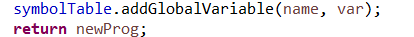
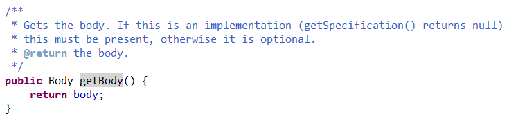
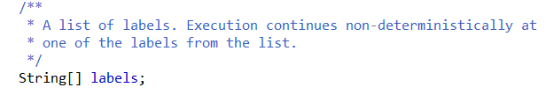
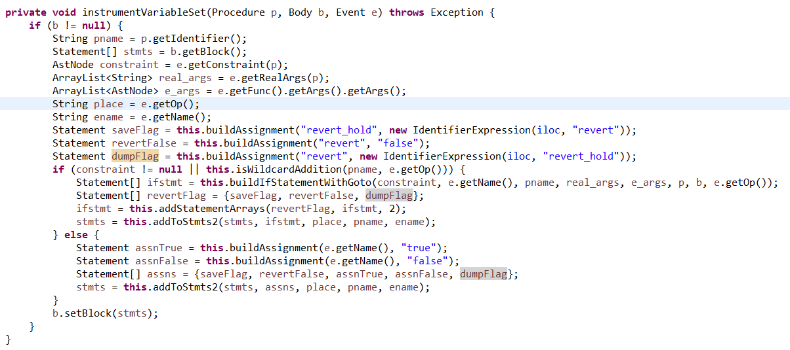

## 插桩Boogie代码思路

- instrument2函数
  - 首先调用getevent函数，递归遍历ast树，将所有event类型收集，加入array中：
  - 然后基于addGobalVar函数，为每个自由变量的定义插桩相应的声明：
    - Unit类型——代表一整个Boogie文件，由一堆顺序不相关的声明组成：
    - addGlobalVar函数：
      - 输入为name + type的字符串，当成tuple也可以，以及要插桩的unit
      - 首先在最前面的Declaration中进行插入：
      - 然后经过一些trival的设置，创建一个Boogie的Declaration：
        - new Attribute[0]为空数组
      - 调用copyToBiigierDec，将原有的declaration拷贝，并使用新声明的dec补充到第一个元素：
        - 
        - 
      - 然后调用unit的setDec方法重设dec：
      - 最后在符号表中插入插桩的变量，返回新程序：
        - 
  - 然后进行event类型的处理：
    - 首先对每个event插桩对应的bool变量：
      - smartltl允许`start(*, formula)`，此时event对应的sunc为corralchoice——在smartpulse中，仅有一个corralchoice为前缀的函数，这个函数供main的无限循环调用：
        - 作用为随机选取事务执行：
      - processed_event从代码中看来似乎是未用的，应该可以忽略
    - 然后提取fsums，因为fsum可以被用作约束，所以需要从每个约束中提取可能含有的fsum，方法就是遍历，若node是fsum则加入：
      - 然后进行globalvar的插桩：
    - 然后对Boogie文件中所有的Procedure进行遍历：
      - 接口getSpec：若为null则为实现，否则为procedure
      - 然后遍历所有的event，若有event对应这个procedure，则为这个specfication加上modify这个event变量的标识：
        - addModifies函数：
          - 创建了一个修改bool类型、全局变量var的spec，并且调用Procedure的setSpec接口加入这个spec
          - 注：无论是SmartPulse还是UA的源码都未找到这个接口，怀疑是utopia小组自己加的但是源码上传的版本不对
      - 然后对procedure的body进行修改：
        - 首先，**仅对于main函数**，对user定义的自由变量全部随机havoc初始化：
          - havocGlobalVar函数：
            - 定义一个havoc statement，并且调用addToStmts2函数——作用为在原有的procedure的stmts中加入新的stmt：
              - addToStmts根据输入的方案（place）生成的newstmts不同：
                - havocGlobalVar为"begin"，直接加如到最前面：
        - 然后若这个procedure对应fsum，则插桩fsum更新的函数；若procedure为ULTIMAT.start（**这是什么？**，猜测为parser的一些小处理），则将所有fsum在start中初始化为0：
          - 初始化全部初始化为0：
            - 
            - 注：这个函数重载了，对于fsum为初始化0，对于event为初始化false
          - 基于Goto实现conditional的fsum的条件赋值：
            - GotoStmts是一个专有类，会产生随机跳转到Labels的任意label的语句
              - 
            - **注：这样处理不会在Ultimate报错GOTO，需要寻找原因**
            - **插入stmt的位置通过遍历所有stmt，然后定位到合适的位置来获取index**（这个stmt为Call statement + 名字匹配——在smartpulse中表示事务调用不被revert，调用成功）
      - 最后对event变量进行插桩：
        - 
        - 若为procedure为start则初始化
        - started谓词被定义为call，即对应代码`e.getOp().equals("call")`
        - 若match或者started相关的特殊情况（这个是domain-specific的 目前并没有探究为什么要这样设置）则插桩event对应的谓词变量的赋值
          - 
          - `getRealArgs`输入一个procedure的参数，从中提取event对应的procedure调用的实际参数
          - saveFlag存储revert变量之前的值到变量revert_hold中
          - revetFalse将revert重置为false
          - dumpFlag为将revert重新赋值为revert_hold
          - 若这个event有约束
            - 则基于event的类型、基于Goto构造赋值语句，然后结合对revert变量的设置，将赋值语句依据event类型插桩到procedure应该对应的地方：
              - `buildIfStatementWithGoto`
                - 因为约束中可能含有作者预定义的function，需要将这些function解析为实际的值：
                - 然后可以得到约束表达式的boogie赋值表达式：
                - 接着基于Goto构建赋值即可：
                  - 注：smartpulse的代码是不是错了？falseLabel后应该是body[1]（body为setFlag的返回值——index 0为置位event对应的变量true，1为false的语句）
          - 若event无约束
            - 则revert赋值为false，否则赋值为true：
      - 若为start的声明（不为实现），则加上所有event的modifies：
    - 最后若没有Ultimate.start则加上一个Ultimate.start，并且加上之前所述的event和function的初始化![../images/image-20220626231413555.png)

- 走一遍start插桩的流程
  - 假设对于`started(func, i != 1)`进行插桩：
    - 首先进入`instrument2`函数
    - 然后依据`#LTLVar`调用`addGlobalvars`初始化全局变量
      - `addGlobalvars`在`Unit`——Boogie文件的代表，Declareation的集合中，插入全局变量的声明
    - 然后为`started`插桩对应的全局变量声明
    - 然后遍历所有的procedure，找寻到`func`这个函数
      - 在声明修改对应的`modify`
      - 在实现中，基于Goto语句生成条件赋值语句块，并且插桩到`func`语句块对应的位置（started是插桩到func语句块的最前面）
    - 在遍历procedure的时候，在`main`这个函数
      - 对自由变量进行havoc赋值
    - 在Ultimate.start代码块中，对于全局变量进行初始化
      - `started`变量初始化为false

- 想要插桩P4LTL，我们需要做的
  - 编写Boogie的接口——下述接口仅在smartPulse中出现，且smartPulse源码并不包含具体实现
    - 但是实际上应该一个赋值语句就可以完成，推测是smartPulse源码的版本管理并不理想导致
    - Procedure类的`setSpecification`
    - Body类的`setLocalVars`
  - 设计插桩规则
    - 例子：`match`应该比较容易设置——因为和`started(*, match(e))`的插桩十分相似
  - 依据插桩规则进行实现
  - 尝试寻找不会报错Goto的原因
    - smartpulse改动了buchiautomizer的代码
    - smartPulse这样的插桩不会影响buchiautomizer的执行
