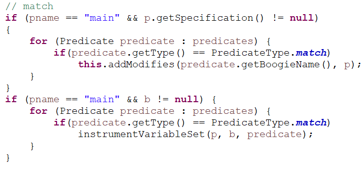
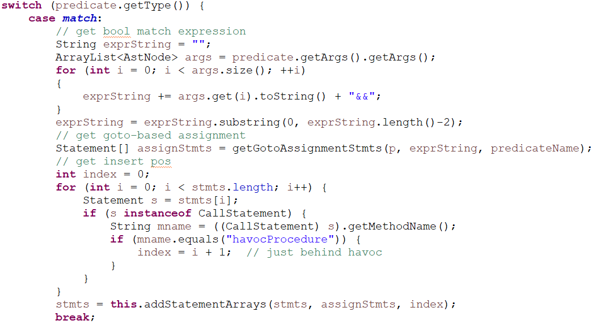
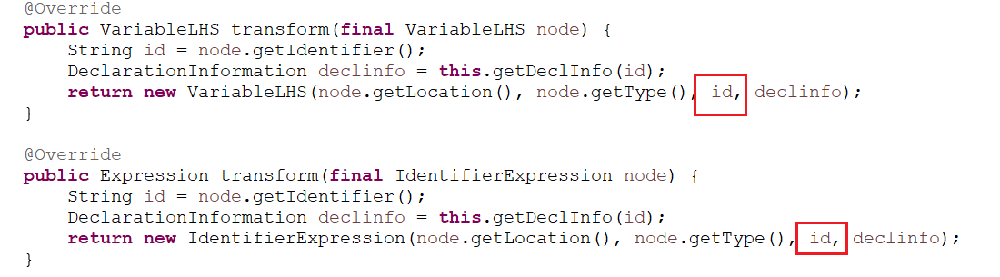

## 添加新谓词

1. 基于P4Boogie设计新谓词的插桩规则——P4LTL的语法 + 应当如何对Boogie进行插桩，使得谓词表示的含义被正确置位

   - example: match

     - > $match(\bar{e})$
       >
       > - $\bar{e}$为测试表达式组成的向量，$v$为$bv$类型的值
       >   - $\bar{e} \rightarrow e | e, \bar{e} $ 
       >   - $e \rightarrow header=v$ | $header$ != $v$
       > - match
       >   - Premise
       >     - s语句为`s = while(true){body1; havocProcedure(); body2;}`
       >     - 为这个match谓词分配一个布尔变量b：$\phi = match(\bar{e})$、$BoolVar(\phi, b)$
       >     - 将表达式$\bar{e}$的结果转化为boogie的结果$\Phi$：将所有等式的结果相与即可计算match
       >       - $\Phi = Boogie(\bigwedge_{e \in \bar{e}} e)$
       >   - conclusion
       >     - s被插桩为了新的程序：$s \rightarrow while(true)\{body1; havocProcedure(); b=\Phi; body2; \}$

2. P4LTL语言的修改

   - 改动`ThufvSpecLang/../parse`中的词法和语法分析器
     - `p4ltl.flex`
       - 向`YYINITIAL`状态添加新谓词的名字
       - 向`PREDICATE`状态添加谓词参数的分词
     - `p4ltl.cup`
       - 向`predicate`非终结符号添加新谓词的语法分析和相应参数的语法分析

3. 插桩代码的修改

   - 在`ast/PredicateType`中添加新谓词的类型
   - 在`instrumentBoogie`函数
     - 第一个for循环中的`switch`部分添加基于新谓词类型的全局变量声明
     - 在第二个for循环中，确定需要插桩的`procedure`名称，添加`modifies`标识和调用`instrumentVariableSet`函数对置位代码进行插桩
       - 注：`modifies`标识是否需要嵌套修改？（smartltl中似乎并不需要嵌套修改）
       - example--match:
   - 在`instrumentVariableSet`函数中，基于`switch`部分添加基于新谓词类型的boogie插桩代码——基于插桩规则实现
     - example--match:
   - 在`P4LTL_DeclarationInformationAdder`类中，如果有需要可以改动之中的方法递归地对Expression所有节点的属性（名字等）进行替换
     - 比如对于`id`可以嵌套一个`changeid`的方法进行递归替换：